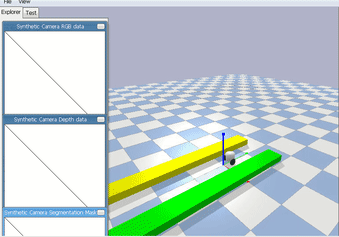
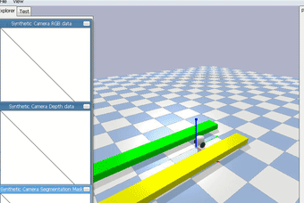
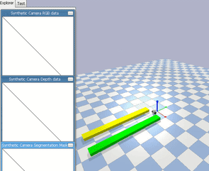
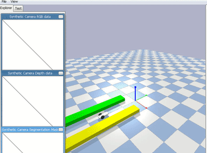

# Mobile robot environment with Gym/Bullet 

1. Build the environment:

``` bash
cd balance-bot
pip install -e .
```

In intask robot  was trained with the evorobotpy/bin/es.py, so you may need to the import
this env in the script: 

```
import wheel_bot
```

To train the model use command(from /result directory where contain wheelbot.ini):
``` bash
python3 ../../bin/es.py -f wheelbot.ini -s (seed)
```

Then to see results use:
``` bash
python3 ../../bin/es.py -f wheelbot.ini -t (model_name)
```
For example 

Model_name : bestgS7.npy. 

## result 

>While training



>Moving forward 





>Moving backward 



> with body box 




> evorobotpy can be found at : https://github.com/snolfi/evorobotpy

> This code is adopted partially from https://backyardrobotics.eu/2017/11/27/build-a-balancing-bot-with-openai-gym-pt-i-setting-up/


